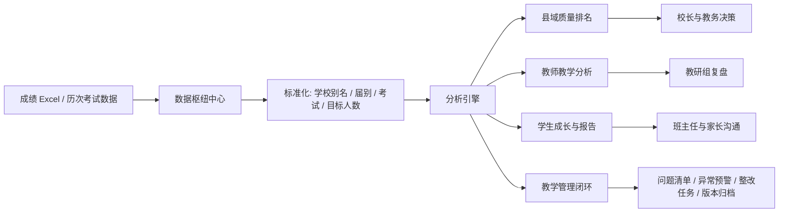
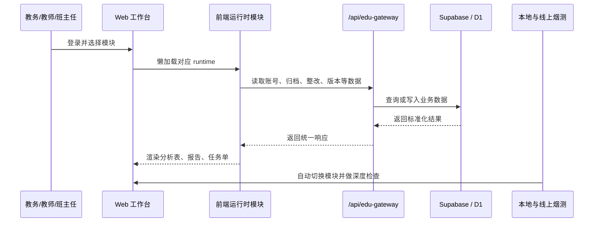
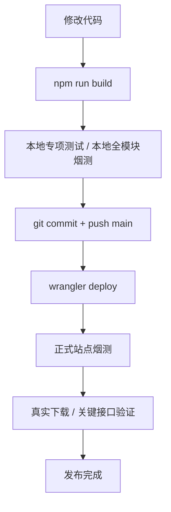

# SmartEdu Analytics

一套正在生产环境运行的学校教务与质量分析系统。它不是一个静态演示页，而是围绕“成绩数据进入系统之后，学校、年级、教师、班主任分别能做什么判断”搭起来的完整工作台。

正式站点：[https://schoolsystem.com.cn/](https://schoolsystem.com.cn/)  
当前生产分支：`main`  
部署平台：Cloudflare Workers + Assets  
数据与网关：Supabase / Cloudflare D1 / `/api/edu-gateway`

## 为什么值得看

很多成绩分析系统只停留在“把 Excel 变成表格”。这个项目更关心后面的链路：

- 教务主任需要快速知道：哪所学校、哪个年级、哪个学科出现了质量波动。
- 年级组需要知道：指标生、后 1/3、临界生、进退步学生分别在哪里。
- 班主任需要知道：学生个人报告、成长轨迹、薄弱学科和同层对比。
- 教师需要知道：自己的教学画像、班级表现和县域/校内位置。
- 管理者需要知道：问题清单、预警、整改任务是否闭环。

系统把这些场景放在同一个工作台里，并配套了本地烟测、线上烟测、下载验证和 Cloudflare 部署流程，避免“页面能打开但业务不可用”。

## 一眼看懂



## 功能地图

| 场景 | 代表模块 | 解决的问题 |
| --- | --- | --- |
| 数据进入系统 | 数据上传、考试归档、届别管理、云端备份 | 把不同来源的成绩数据整理成可分析的统一口径 |
| 学校质量分析 | 综合分析、两率一分、县域质量排名、学科贡献度 | 看清学校、乡镇、县域之间的质量位置 |
| 教师教学诊断 | 教师教学分析、教师画像、校内/县域排名 | 让教师评价从印象判断变成可追溯指标 |
| 学生发展跟踪 | 学生总览、学生明细、进退步、成长档案、成绩报告 | 形成学生个人层面的连续观察 |
| 教学管理闭环 | 教学管理总览、问题清单、异常预警、整改任务 | 把发现问题到跟进整改串起来 |
| 教务工具 | 考务编排、新生均衡分班、座位微调、应用服务 | 处理日常教务中的高频事务 |

## 系统如何流动



## 技术结构

```text
src/                       页面入口和模板
public/assets/js/          前端运行时模块
scripts/                   构建、验证、烟测、部署辅助脚本
supabase/                  Edge Functions、SQL、迁移脚本
cloudflare/                Worker 相关代码
dist/                      Vite 构建产物
lt.html                    单文件离线版本
wrangler.jsonc             Cloudflare Workers 部署配置
```

核心思路是把巨大的前端业务拆成多个 runtime：

- `app.js`：公共配置、入口调度和少量兼容逻辑
- `*-state-runtime.js`：状态与持久化边界
- `*-runtime.js`：独立业务模块
- `cloud-*-runtime.js`：云端连接、数据读写和同步
- `teaching-management-*-runtime.js`：教学管理模块
- `app-download-runtime.js`：应用服务、APK/Windows 下载和版本中心

## 本地运行

```bash
npm install
npm run dev
```

构建生产产物：

```bash
npm run build
```

常用验证：

```bash
npm run check:release-fast
npm run smoke:modules:local
npm run smoke:modules:prod
```

更完整的回归：

```bash
npm run validate
```

## 发布链路



Cloudflare 手动部署命令：

```powershell
$env:npm_config_cache = "$PWD\.npm-cache"
npx wrangler deploy
```

Current recommended release path:

```bash
npm run build
npx wrangler deploy
npm run verify:prod-minimal
```

Legacy OSS, DNS, certificate, and direct-deploy helpers are archived in `scripts/legacy/`. Keep new releases on the Wrangler path unless a recovery note explicitly says otherwise.

## 质量保护

这个仓库对“能不能真的用”看得比“能不能构建”更重。常见保护包括：

- 全模块自动切换烟测：确认主模块和数据中心页签能打开。
- 深度业务检查：报告生成、学生明细、县域排名、教学管理等关键路径会检查真实 DOM 和函数。
- 下载验证：应用服务中的 Windows 包和 Android APK 会做真实请求与点击下载检查。
- 性能预算：记录模块切换耗时、深度检查耗时和长任务。
- Cloudflare 合约检查：部署配置、静态资源和 Worker 路由保持可验证。

## 自动化流水线

- `.github/workflows/release-apps.yml`：手动输入 tag 或推送 `school-system-v*` tag 后，自动构建、检查下载入口、整理 APK 与 Windows 包，并创建或更新 GitHub Release。
- `.github/workflows/performance-trend.yml`：`main` 更新后自动跑本地浏览器烟测，把原始性能样本、跨提交历史和 Markdown 趋势报告写入 `docs/performance/`。
- `npm run release:prepare-assets`：本地生成 GitHub Release 资产目录，包含 latest 文件名、带 tag 的不可变文件名、SHA256 和 release notes。
- `npm run performance:record`：把一次烟测 JSON 转成可对比的趋势记录，用于定位哪次提交让模块切换、深度检查或长任务变慢。

## 维护分级

长期维护按 P0/P1/P2 分级处理，完整发布清单和缓存规则见 [`docs/maintenance-runbook.md`](docs/maintenance-runbook.md)。
持续优化清单见 [`docs/optimization-backlog.md`](docs/optimization-backlog.md)。

- P0：生产正确性，优先保护登录、关键数据、报告、下载和线上可访问性。
- P1：发布质量与用户体验，优先保护文案编码、元数据、离线缓存和回归检查。
- P2：可持续维护，优先保护文档、自动化守护、交接清单和可追溯发布记录。

## 应用下载

“应用服务”保留当前可用下载入口：

- Windows：`/downloads/smartedu-windows-latest.zip`
- Android：`/downloads/school-system-android-v1.0.apk`

旧的历史版本更新文件已清空。以后发布新的 APK 或 Windows 应用包时，版本记录从当前入口重新累积。

## 适合继续改进的方向

- 继续把高耦合业务从 `app.js` 拆到独立 runtime，降低首屏和模块切换压力。
- 给教学管理、学生报告、县域排名等高价值模块增加更细的端到端用例。
- 在性能趋势报告基础上增加自动阈值告警，让明显变慢的提交在 CI 中直接标红。

## 给维护者的一句话

修改这个系统时，请把它当作一个真实学校正在使用的生产工作台：先保证登录、数据、报告、教学管理和下载入口可用，再谈重构和美化。每一次发布都应该能回答三个问题：

1. 用户最常用的路径还能不能走通？
2. 关键数据有没有被错误覆盖或错口径展示？
3. 线上站点是否已经用真实浏览器和真实下载验证过？

## 多平台应用发布中心（2026）

“应用服务”母模块现在统一展示 Windows、Android 与 iOS 的最新版、构建状态、系统要求、SHA-256 和历史版本。GitHub Releases 中的 `release-manifest.json` 是安装包状态的权威来源；Windows 与 Android 只有在包体、扩展名、哈希和下载响应全部通过后才标记为可下载，iOS 未完成 Apple 签名时只显示进度，不暴露伪造的 IPA 链接。

### 发布节奏与保留策略

- 每次推送到 `main`：`.github/workflows/build-apps-beta.yml` 并行构建 Windows、Android 和 iOS 验证任务，发布 `beta-YYYYMMDD-<short-sha>` 预发布版本。
- Beta Release 保留 90 天；每周清理任务只删除同时满足“`beta-` 标签、GitHub prerelease、超过 90 天”的版本。
- 推送 `school-system-v*` 标签：`.github/workflows/release-apps.yml` 创建永久稳定版，不参与 Beta 清理。
- Windows 产物为 x64 NSIS `.exe`；Android 产物为测试签名 `.apk`；当前 iOS 只做无签名 Simulator 编译并记录 `awaiting-signing`。

### 签名与安装提醒

- Windows 当前没有代码签名证书，安装时可能出现 Microsoft Defender SmartScreen 提示。正式对外分发前应配置受信任的 Windows 代码签名证书。
- Android CI 使用独立测试 keystore，不应当用于 Google Play 正式发布。仓库绝不保存 keystore 或密码。
- Android Actions 需要四个 Secrets：`ANDROID_TEST_KEYSTORE_FILE`（keystore 的 Base64 内容）、`ANDROID_TEST_KEYSTORE_PASSWORD`、`ANDROID_TEST_KEY_ALIAS`、`ANDROID_TEST_KEY_PASSWORD`。
- 只有在明确批准后，才运行 `node scripts/configure-android-test-signing.mjs <仓库外绝对路径>` 创建测试 keystore；脚本拒绝仓库内路径。
- iOS 目前不会生成或展示 IPA，也不会上传 TestFlight/App Store。

### TestFlight / App Store 前置条件

启用 iOS 正式发布前，需要 Apple Developer Program 账号、App Store Connect 中的应用记录、`cn.com.schoolsystem.app` Bundle ID、Team ID，以及 Distribution Certificate 与 Provisioning Profile，或受限权限的 App Store Connect API Key（Issuer ID、Key ID、`.p8` 私钥）。这些凭据必须进入 GitHub Actions Secrets；配置完成后再增加 Archive、签名、IPA 导出与 TestFlight 上传步骤。

### 手动构建与校验

```powershell
npm run build
npm run test:release-manifest
npm run test:desktop-package-contract
npm run test:capacitor-package-contract
npm run test:beta-release-workflow
npm run desktop:build
npm run mobile:sync
cd android
./gradlew.bat assembleDebug
```

Android 构建使用 Java 21。Windows 无法执行 Xcode 编译；请以 macOS GitHub Actions 的 `xcodebuild` 结果作为 iOS 工程验证依据。发布后可运行 `npm run release:verify-assets`，按平台返回结构化失败列表并阻止 HTML 错误页、过小包体或无效哈希进入下载中心。
