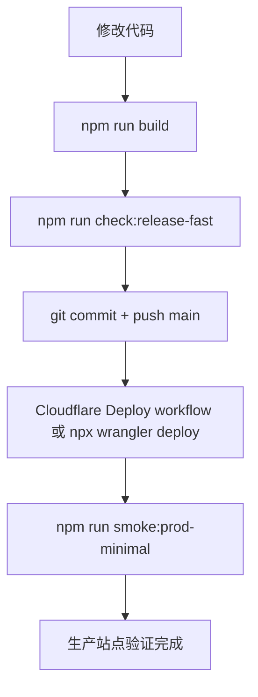

# SmartEdu Analytics

SmartEdu Analytics 是运行在生产环境的学校教务与质量分析工作台。当前唯一正式发布面是 Web 系统：

- 正式站点：[https://schoolsystem.com.cn/](https://schoolsystem.com.cn/)
- 生产分支：`main`
- 部署平台：Cloudflare Worker + Assets
- 数据与网关：Supabase / Cloudflare D1 / `/api/edu-gateway`

Windows、Android 与 iOS 安装包链路均已移除。仓库不再维护本地安装包、下载清单、分片文件、安装器源码、桌面客户端壳或 native app 发布 workflow。

## 本地运行

```bash
npm install
npm run dev
```

生产构建：

```bash
npm run build
```

常用验证：

```bash
npm run check:release-fast
npm run smoke:modules:local
npm run smoke:modules:prod
```

完整回归：

```bash
npm run validate
```

## 发布链路



手动部署：

```powershell
$env:npm_config_cache = "$PWD\.npm-cache"
npx wrangler deploy
```

推荐发布命令：

```bash
npm run build
npm run check:release-fast
npx wrangler deploy
npm run verify:prod-minimal
```

Legacy OSS、DNS、证书和 direct-deploy 辅助脚本已归档在 `scripts/legacy/`。除非恢复说明明确要求，否则新发布保持在 Wrangler 路径。

## 自动化

- `.github/workflows/deploy-cloudflare.yml`：`main` 推送或手动触发后构建、运行快速守卫、部署 Cloudflare，并执行生产 smoke。
- `.github/workflows/performance-trend.yml`：记录性能趋势，输出到 `docs/performance/`，并通过阈值检查阻止明显回归。
- `.github/workflows/ci.yml`：保留 P0 快速通道、release guards、浏览器 smoke 和完整验证。

已删除的 native 发布面：

- `.github/workflows/build-apps-beta.yml`
- `.github/workflows/release-apps.yml`
- 公开下载目录、安装包清单、分片文件和 Worker 下载代理
- Windows 桌面壳、安装器源码、本地共享盘客户端更新脚本和相关校验脚本

## 质量保护

这个仓库优先保护真实可用性：登录、数据、报告、教学管理、生产部署和 smoke 验证。

- `npm run check:p0`：生产正确性和数据安全。
- `npm run check:p1`：发布质量、HTML/service worker/runtime/CSS 体验。
- `npm run check:p2`：文档、自动化、性能趋势和维护守卫。
- `npm run check:release-fast`：部署前共享快速闸门。
- `npm run verify:prod-minimal`：最小生产验证。
- `npm run smoke:prod-minimal`：生产 smoke 别名。

维护分级见 [`docs/maintenance-runbook.md`](docs/maintenance-runbook.md)，持续优化清单见 [`docs/optimization-backlog.md`](docs/optimization-backlog.md)。

## 项目结构

```text
src/                       页面入口和模板
public/assets/js/          前端运行时模块
public/assets/css/         样式资源
scripts/                   构建、验证、烟测、部署辅助脚本
supabase/                  Edge Functions、SQL、迁移脚本
cloudflare/                D1 SQL 和 Worker 相关资源
dist/                      Vite 构建产物
lt.html                    构建时生成的单文件离线版本，不提交 Git
wrangler.jsonc             Cloudflare Worker 部署配置
docs/performance/          性能趋势输出
scripts/legacy/            已归档的历史 OSS/DNS/证书/direct deploy 脚本
```

## 维护提醒

修改系统时，把它当作真实学校正在使用的生产工作台：先保证登录、关键数据、报告和教学管理可用，再做重构和美化。每次发布都应回答三件事：

1. 用户最常用路径还能不能走通？
2. 关键数据有没有被错误覆盖或错口径展示？
3. 线上站点是否已经用真实浏览器验证过？
