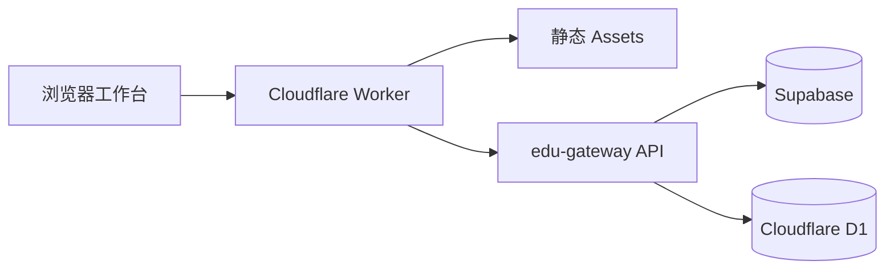
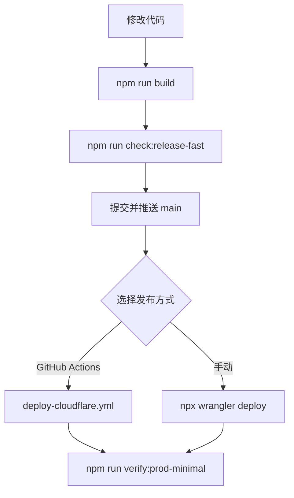

# SmartEdu Analytics

> 面向学校教务团队的成绩管理、横向评价与教学决策工作台。

<p align="center">
  <a href="https://schoolsystem.com.cn/"><strong>打开生产站点 →</strong></a>
</p>

<p align="center">
  
  
  
</p>

SmartEdu Analytics 是一个面向真实学校场景的 Web 工作台，覆盖登录、学段与考试管理、成绩分析、教师与班级对比、报告生成和教学支持。系统当前唯一正式发布面为 Web：

- 正式站点：[schoolsystem.com.cn](https://schoolsystem.com.cn/)
- 生产分支：`main`
- 运行平台：Cloudflare Worker + Assets
- 数据与网关：Supabase、Cloudflare D1、`/api/edu-gateway`

Windows、Android 与 iOS 安装包链路均已移除。仓库不再维护本地安装包、下载清单、分片文件、安装器源码、桌面客户端壳或 native app 发布 workflow。

## 产品工作区

| 工作区 | 解决的问题 | 典型输出 |
| --- | --- | --- |
| 数据中心 | 统一维护学校、教师、学生与考试数据 | 可追溯的基础数据 |
| 成绩分析 | 识别学科、班级和学生层面的变化 | 分布、排名、趋势与差异 |
| 横向评价 | 支持学校、年级、班级和教师多维比较 | 对比结论与教学线索 |
| 教学决策 | 把结果转化为可执行的跟进任务 | 报告、重点学生与行动建议 |

## 技术架构



## 快速开始

环境要求：Node.js 18+、npm 9+。

```bash
npm install
npm run dev
```

本地开发服务器启动后，按终端提示打开地址即可。生产构建：

```bash
npm run build
```

## 验证与发布

提交前建议至少执行快速发布闸门：

```bash
npm run check:release-fast
```

常用本地与生产验证：

```bash
npm run smoke:modules:local
npm run verify:prod-minimal
npm run smoke:prod-minimal
```

完整基线验证：

```bash
npm run validate
```

### 发布流程



手动发布命令：

```bash
npm run build
npm run check:release-fast
npx wrangler deploy
npm run verify:prod-minimal
```

## 自动化工作流

- `.github/workflows/deploy-cloudflare.yml`：`main` 推送或手动触发后构建、执行快速守卫、部署 Cloudflare，并运行生产 smoke。
- `.github/workflows/performance-trend.yml`：记录性能趋势，输出到 `docs/performance/`，并通过阈值检查阻止明显回归。
- `.github/workflows/ci.yml`：执行 P0 快速通道、release guards、浏览器 smoke 和完整验证。

Legacy OSS、DNS、证书和 direct-deploy 辅助脚本已归档在 `scripts/legacy/`。除非恢复说明明确要求，否则新发布保持在 Wrangler 路径。

## 目录导航

```text
src/                       页面入口与模板
public/assets/js/          前端运行时模块
public/assets/css/         样式资源
scripts/                   构建、验证、烟测与部署脚本
supabase/                  Edge Functions、SQL 与迁移脚本
cloudflare/                D1 SQL 与 Worker 资源
dist/                      Vite 构建产物
lt.html                    构建生成的单文件版本
wrangler.jsonc             Cloudflare Worker 配置
docs/performance/          性能趋势输出
scripts/legacy/            已归档的历史发布脚本
```

## 质量与维护

系统优先保护登录、关键数据、报告、教学管理和生产部署链路：

- `npm run check:p0`：生产正确性与数据安全。
- `npm run check:p1`：发布质量、运行时、HTML、Service Worker 与 CSS 体验。
- `npm run check:p2`：文档、自动化、性能趋势与维护守卫。
- `npm run check:release-fast`：部署前共享快速闸门。

维护分级见 [`docs/maintenance-runbook.md`](docs/maintenance-runbook.md)，持续优化清单见 [`docs/optimization-backlog.md`](docs/optimization-backlog.md)。届别身份与跨届守卫规则见 [`docs/cohort-identity-contract.md`](docs/cohort-identity-contract.md)。

每次发布前确认：

1. 登录、数据、报告和教学管理主路径可正常完成。
2. 计算口径与关键数据未被意外改变。
3. 线上站点已通过真实浏览器或生产 smoke 验证。

## 贡献与问题反馈

请在提交 Issue 或 Pull Request 时说明复现路径、预期行为、实际行为及验证命令。涉及数据口径或权限变更时，同时补充影响范围和回滚方案。
